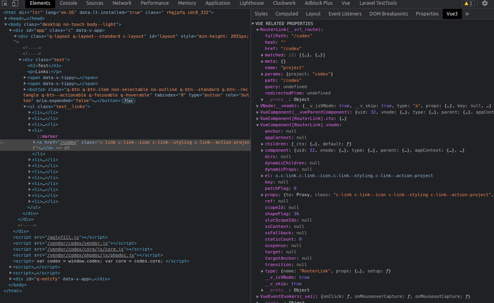

# chrome radic vuejs

It adds a sidebar tab in the elements inspection panel that shows the currently selected component.

I created this because the official vue devtools requires you to "re-open" the whole damn tree every time, which can take up quite some time. 

With this, it makes it possible to inspect an element and see the component options directly. 

I've also added `route`, `router` and `store` if you're using `vue-router` or `vuex`.

 


## Installation

	$ npm install

## Usage

Run `$ gulp --watch` and load the `dist`-directory into chrome.

## Entryfiles (bundles)

There are two kinds of entryfiles that create bundles.

1. All ts-files in the root of the `./app/scripts` directory
2. All css-,scss- and less-files in the root of the `./app/styles` directory

## Tasks

### Build

    $ gulp


| Option         | Description                                                                                                                                           |
|----------------|-------------------------------------------------------------------------------------------------------------------------------------------------------|
| `--watch`      | Starts a livereload server and watches all assets. <br>To reload the extension on change include `livereload.js` in your bundle.                      |
| `--production` | Minifies all assets                                                                                                                                   |
| `--verbose`    | Log additional data to the console.                                                                                                                   |
| `--vendor`     | Compile the extension for different vendors (chrome, firefox, opera, edge)  Default: chrome                                                                 |
| `--sourcemaps` | Force the creation of sourcemaps. Default: !production                                                                                                |


### pack

Zips your `dist` directory and saves it in the `packages` directory.

    $ gulp pack --vendor=firefox

### Version

Increments version number of `manifest.json` and `package.json`,
commits the change to git and adds a git tag.


    $ gulp patch      // => 0.0.X

or

    $ gulp feature    // => 0.X.0

or

    $ gulp release    // => X.0.0


## Globals

The build tool also defines a variable named `process.env.NODE_ENV` in your scripts. It will be set to `development` unless you use the `--production` option.


**Example:** `./app/background.ts`

```typescript
if(process.env.NODE_ENV === 'development'){
  console.log('We are in development mode!');
}
```


